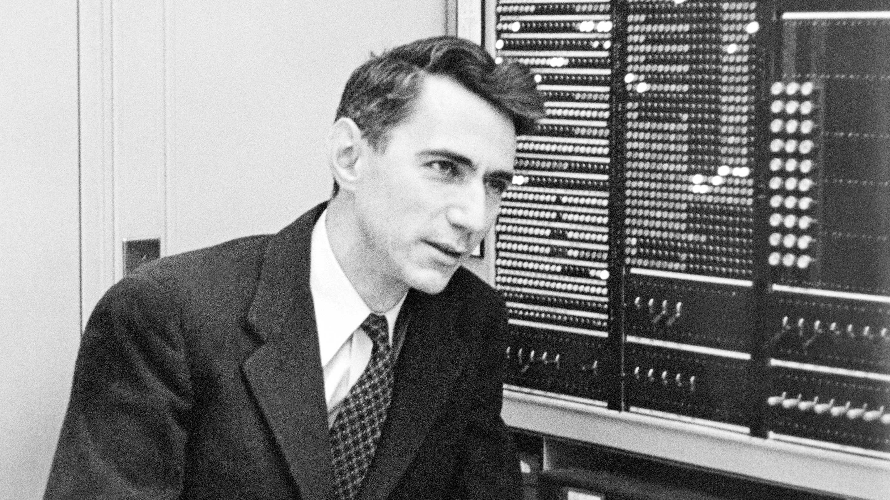

> **Information is the resolution of uncertainty.**
>
> Claude E. Shannon

If you ask someone to name a few of the most famous scientists, there are a few names that are bound to pop up. Einstein, Newton, Galileo, Darwin, Hawking, for sure. Maybe you'll get Tesla, Babbage, Lovelace or Turing, for the more techy; or Kepler, Planck, Bohr and Maxwell, for the more physic-sy. Or maybe you'll get none at all! That's also cool, not everyone is out here memorising dead white guys' names!

Anecdotally, not a single person I've asked (or even Google, for that matter) mentions Claude Shannon – which is ironic, because if you had to pick a single scientist who's had the greatest impact on the daily life of you and I, you could do worse than pick Shannon from the bench. I definitely would.

It's hard to understate Shannon's impact on human civilization. One man, with one brain and two hands, and yet – to use a hackneyed Jobs-ism – he made his **dent in the universe** which will continue un-hammered-out for as long as human civilization exists. [^1]

I can say this confidently now, having gained a much better understanding of Shannon and his work thanks to [A Mind at Play,](https://www.simonandschuster.com/books/A-Mind-at-Play/Jimmy-Soni/9781476766690) a biography by Jimmy Soni and Rob Goodman. A friend of mine lent the book to me a year or more ago, and I'm only just getting around to it, but I'm glad I did.

Being one of those crazy maniacs who studied CS (they called it [Informatics](https://en.wikipedia.org/wiki/Informatics)) for *four* years, I was aware of his work, but I never knew until now how he pretty much single-handedly created a whole new field of science, [Information Theory,](https://en.wikipedia.org/wiki/Information_theory) and laid the groundwork that enabled us all to live in this Information Age that we just call, "the present".

[^1] Who knows, maybe the sentient machine civilization that follows us will continue remembering him! Maybe he'd have a public holiday named after him. I'd like to think so.

https://www.newyorker.com/tech/annals-of-technology/claude-shannon-the-father-of-the-information-age-turns-1100100

https://web.archive.org/web/20211106221100/https://spectrum.ieee.org/celebrating-claude-shannon

https://hackaday.com/2016/04/29/centennial-birthday-of-claude-e-shannon-the-math-and-ee-pioneer/

https://www.quantamagazine.org/how-claude-shannons-information-theory-invented-the-future-20201222/
