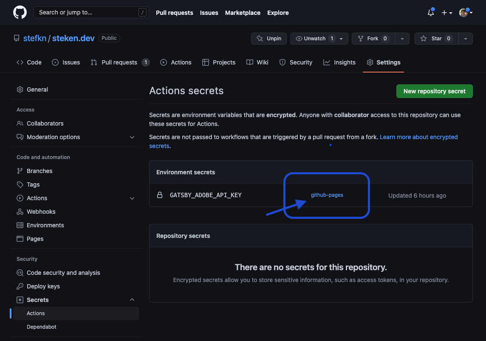

On the road to shipping this website I had to figure out a few things. Well, maybe more than a few things. In the hopes that this is helpful to someone (or, at the very least, a future-me who has forgotten how everything was set up) I'm going to document how I configured Gatsby and GitHub Actions to build and deploy this site to GitHub Pages, including how I set up secret management for this project. So lets go!

There are probably many ways to go about this goal, but we'll go the simplest route by using the `gh-pages` package which can be found [here.](https://www.npmjs.com/package/gh-pages)

First, let's add `gh-pages` as a project dependency. Go to your project's `package.json` and add it to `devDependencies` like this:

```json
"devDependencies": {
    "gh-pages": "^3.2.3",
    "prettier": "^1.15.2"
}
```

Now find the `scripts` section. In this project, this looks like this:

```json
"scripts": {
    "build": "gatsby build",
    "dev": "gatsby develop -p 8050",
    "start": "npm run dev",
    "format": "prettier --write \"src/**/*.js\"",
    "clean": "rm -rf .cache && rm -rf public",
},
```

Notice that each of the keys is associated with a string that is a valid command-line command. Our package manager (in this case, [Yarn](https://yarnpkg.com/)) simply runs this script when you call it with a given script's key as an argument. For example, when I want to bring up the local development version of this project, I just call `yarn dev`, and Yarn takes care of running `gatsby develop -p 8050`.

<iframe src='https://gfycat.com/ifr/SparklingFittingAurochs' frameborder='0' scrolling='no' allowfullscreen width='100%' height='535'></iframe><p>It's a Unix system... you know this!</p>

```json
"scripts": {
    "build": "gatsby build",
    "dev": "gatsby develop -p 8050",
    "start": "npm run dev",
    "format": "prettier --write \"src/**/*.js\"",
    "clean": "rm -rf .cache && rm -rf public",
    "deploy": "gatsby build && gh-pages -d public -r https://$GITHUB_TOKEN@github.com/stefkn/steken.dev.git"
},
```

When you install `gh-pages`, it creates a `gh-pages` command line utility. Run `gh-pages --help` to see a list of supported options. Since it will be installed when we install our dependencies to run the project, we can use it in the deploy script to handle the GitHub Pages deployment. In the deploy script above, we use the `-d` argument to point it to the `/public` directory, which means it will copy everything in `/public` and push it to the `gh-pages` branch on the remote, which will trigger a GitHub Actions Workflow to be published on GitHub Pages.

You can also see how this works by running it locally. (this also saves you from having to run your builds remotely if you're not using GitHub Pages and want to use as few credits as possible) Just `cd` into the top level directory of the repo and run `yarn run build`. This is exactly what the task runner would do on GitHub actions as well, just not on your machine. The end result is the same though, it will copy everything in `/public` and push it to the `gh-pages` branch on the remote. This triggers another task to deloy the built files from that branch. You should see output that looks like the below: if you do, congrats, you've just deployed your site!


```shell-session
$ yarn run build
yarn run v1.22.4
gatsby build
success open and validate gatsby-configs - 0.064s
success load plugins - 0.899s
success onPreInit - 0.038s
success delete html and css files from previous builds - 0.018s
success initialize cache - 0.004s
success copy gatsby files - 0.175s
success onPreBootstrap - 0.022s
success createSchemaCustomization - 0.164s
success Checking for changed pages - 0.001s
success source and transform nodes - 0.188s
success building schema - 0.693s
info Total nodes: 157, SitePage nodes: 11 (use --verbose for breakdown)
success createPages - 0.080s
success Checking for changed pages - 0.001s
success createPagesStatefully - 0.148s
success Cleaning up stale page-data - 0.002s
success update schema - 0.127s
success onPreExtractQueries - 0.005s
success extract queries from components - 1.314s
success write out redirect data - 0.014s
success Build manifest and related icons - 3.614s
success onPostBootstrap - 3.630s
info bootstrap finished - 11.444s
success run page queries - 2.263s - 11/11 4.86/s
success write out requires - 0.018s
success Building production JavaScript and CSS bundles - 7.700s
success Rewriting compilation hashes - 0.003s
success Building HTML renderer - 1.878s
success Building static HTML for pages - 0.338s - 15/15 44.34/s
success Generating image thumbnails - 12.583s - 37/37 2.94/s
success onPostBuild - 0.004s
info Done building in 24.097625255 sec

✨  Done in 24.69s.
$ gh-pages -d public -r https://$GITHUB_TOKEN@github.com/stefkn/steken.dev.git
Published
```

## Handling Secrets (shh!)

Hold on though, not so fast -- you will need to authenticate. How? See the `$GITHUB_TOKEN` there? That's going to be substituted with your GitHub repo's [Personal Access Token](https://docs.github.com/en/authentication/keeping-your-account-and-data-secure/creating-a-personal-access-token) (PAT) which you'll need to make and add to your environment variables. This is also a good time to talk about Secrets.

This project (and most projects with any kind of external service dependency) will probably have a few or more API keys and access tokens to juggle. We can't just commit them in code to the repo, because they would be open and available for the public (and bad actors) to steal and use! The solution is to use [encrypted project secrets.](https://docs.github.com/en/actions/security-guides/encrypted-secrets)

One important thing to note here though: since we're building a static site, we're _a little limited_ in what we can do with regards to secret management.

We can of course have **build-time secrets**, which are secrets that can only be accessed during the build process in the context of whatever runs your build (such as a [VM](https://en.wikipedia.org/wiki/Virtual_machine), a [serverless function](https://en.wikipedia.org/wiki/Serverless_computing) or a [Docker container](https://www.docker.com/resources/what-container/)) but can't be accessed outside of there. For example, say, if your static site relied upon a lot of licensed assets from a stock photo library API that you pay for – in the build process you could store the key as an encrypted build-time project secret, and the build runner would get that secret, use it to authenticate some requests for the said content at build-time, grab the assets it needs, package them up, and then deploy.

What we can't really support are runtime secrets.[^*] These are secrets that would be needed while the site code is actually running in a user's browser. Secrets will always be exposed through network calls however clever we get in hiding them while they're stored in the JavaScript bundle. This is because with a purely frontend static site framework like Gatsby (which is React under the hood) everything is running in browser-land, where we're at the mercy of anyone who can enable DevTools and right click on "Inspect".

If we need to securely store secrets, our options are basically limited to [proxying](https://en.wikipedia.org/wiki/Proxy_server) the request in some manner, either by using a [Backend-For-Frontend](https://docs.microsoft.com/en-us/azure/architecture/patterns/backends-for-frontends) (BFF) or a serverless function, mediating the external calls there and storing the keys on that layer instead.[^1] This gives us a secure environment that we control where we can keep our keys safe, and mediate access to whatever resource the keys unlock without *actually giving out the keys themselves.*

With that disclaimer out of the way, let's store a build-time secret for the Adobe View SDK, which I use to render the PDF of my CV on the About Me page. I'm going to do this more as a learning exercise than a security measure, as **the key will be included in the static site's data so that users viewing the site can use the Adobe PDF viewer.** Luckily, it's free for unlimited use, and each key is restricted by domain, so there's not a lot a bad actor can do even if they do extract the key.

## Setting up environment variables

Check out [Gatsby's official docs](https://www.gatsbyjs.com/docs/how-to/local-development/environment-variables/) here.

First, we should set up environment variables for development. For that, we can create a file called `.env.development` (Gatsby looks for this file so make sure it's called exactly that!) by using the command `touch .env.development`. It's a good idea to add this file to the `.gitignore` file so you don't commit it as well.

In here we can put our Adobe API Key which has been set up to allow usage on the host `localhost`, so it loads correctly during local development. **We also prefixed the name with `GATSBY_` because this allows the variable to be exposed to the browser code** If you don't prefix it, it will only be available to Node.js code during build-time and you'll get nothing when you try to use it in React-land in the browser! This is Gatsby's method of making sure you're *absolutely sure that you want to share your environment variables with the whole world*.

```shell
# .env.development
GATSBY_ADOBE_API_KEY=51f01227cb65ff4e05fffd40ff471bbd41234d
```

Next, go to `gatsby-config.js` and do a cheeky `require` at the top:

```javascript
require("dotenv").config({
  path: `.env.${process.env.NODE_ENV}`,
})

module.exports = {
  plugins: [ ...
```

Now in our code, we can access the variable like so:

```javascript
var adobeDCView = new window.adobe_dc_view_sdk.default({
    clientId: `${process.env.GATSBY_ADOBE_API_KEY}`,
    divId: 'adobe-dc-view',
});
```

Done! Now, the harder part. How do we get this into our build?

## Environment variables with GitHub Actions

This will be specific to GitHub Actions but probably similar to other CI/CD providers too.

First we'll need to generate a new key for Adobe View SDK which is allowed to be used on the actual hostname of this site, steken.dev. To do that, go to the developer console and follow the instructions to generate some new keys.

Next, go to your repo and go to Settings -> Environments -> Environment Secrets, and add it, making sure it has the exact same name here as it does in the `.env.development` file. Once that's done, double-check which environment the secret exists in by going to Settings -> Secrets -> Actions and looking at the link highlighted here:



Getting close now! It's time to set up a deployment process with GitHub Actions.


[^*] (As with everything on this site, caveat emptor: to the best of my knowledge!)

[^1] This is all what I understand from this [StackOverflow discussion](https://stackoverflow.com/questions/62231572/how-to-store-and-access-api-keys-and-passwords-with-gatsby)